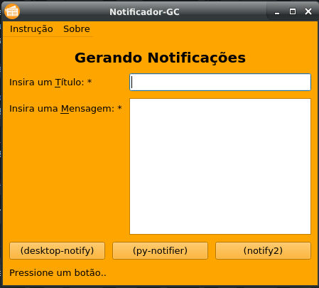
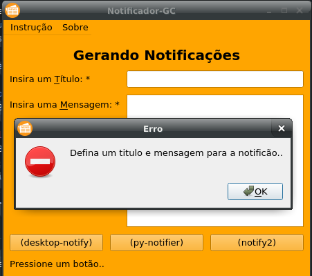
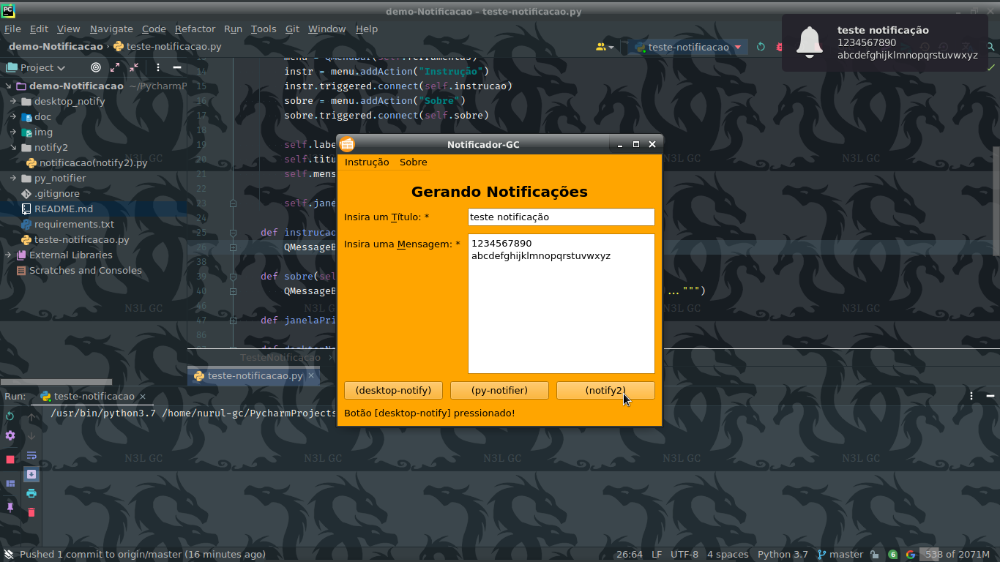

# demo-Notificação

    Este script-programa serve para apresentar como se
    gera notificações no ambiente principal..
    Usando três ferramentas diferentes
    e suas respectivas sintaxes..
    
| para mais informações |
| --- |
| leia os PDFs localizados na pasta `./doc/` ou [clique aqui..](/doc)* |

## Demo-GUIs

`Ecrã Principal Teste` \

`Retornando Erro` \

`Gerando a Notificação` \

## Requirements

Windows:
- `pip install -r requirements.txt`

Linux:
- `python3 -m pip install -r requirements.txt`
- `sudo pip3 install -r requirements.txt`

    
&copy; 2021 [Nurul Carvalho](mailto:nuruldecarvalho@gmail.com) | &trade; [ArtesGC](https://artesgc.home.blog)
    

